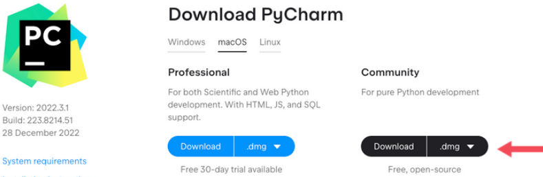
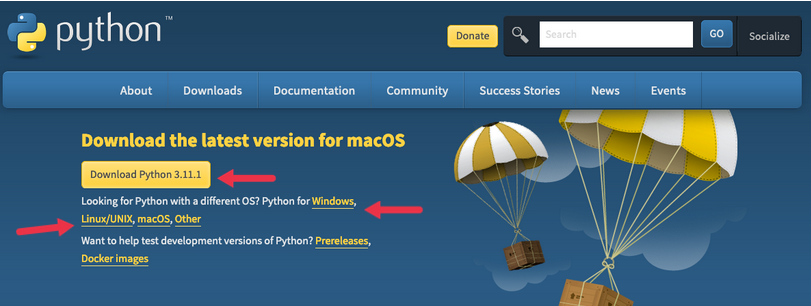
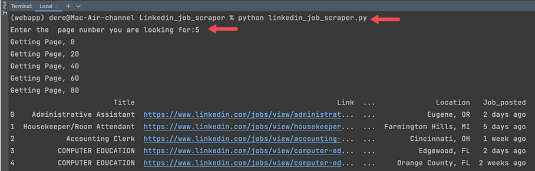
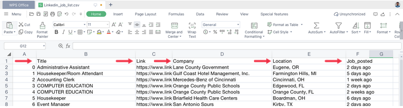

## Linkedin_job_scraper
I am going to scrape public available jobs on Linkedin using headless browser.
For each job, the following fields are extracted: 

      .Job_title,
      
      .Link, 
      
      .Company_name,
      
      .Job_posted time.
      

#Follow the following steps to install the requirements.

#1# Download Pycharm IDE: https://www.jetbrains.com/pycharm/download/#section=windows

you can use your favorite text editor or IDE

  

#2.Install Python programming language : https://www.python.org/

  

### Install library

resource : https://pypi.org/project/bs4/

       .$pip install bs4
  
resource : https://pypi.org/project/requests/

      .$pip install request
  
resourse :https://pypi.org/project/pandas/

      .$pip install pandas
  
resource : https://pypi.org/project/python-csv/

      .$pip install python-csv
  

### follow the Steps to run the linkedin_job_scraper.py

  1.open the pycharm IDE and open the file 
  
    $python linkedin_job_scraper.py.
    
    Enter the page number :numbeer
    
 ### Look at the output
 
  
 
 
 ### Open the Linkedin_job_list.csv file and here is what finally we got.
 
  
  
  Done!
 
  
